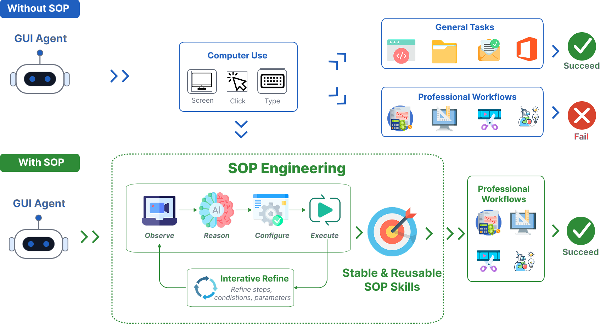

# OmegaUse-SOP

**SOP Engineering for Professional Computer Use from Human Demonstrations**

*Baidu, Inc. × Ningxia Electric Power Engineering Co., Ltd.*

[📺 Demo Video](https://www.youtube.com/watch?v=FQO_eyL_seE) · [📄 Paper](#citation)

---



*General computer use succeeds on general tasks but fails on professional workflows (top). With SOP Engineering — Observe → Reason → Configure → Execute plus iterative refinement — demonstrations become stable, reusable SOP skills that make professional workflows succeed (bottom).*

OmegaUse-SOP is a **human-in-the-loop SOP Engineering system** that transforms human demonstrations of professional computer use into reusable **SOP skills** for GUI agents.

General-purpose GUI agents perform well on open-ended computer-use benchmarks, but professional workflows are different: they depend on **domain-specific standard operating procedures (SOPs)**, software-specific conventions, implicit expert knowledge, configurable task parameters, and task-level verification. A professional workflow is not merely a long sequence of clicks — it is a trained practice.

Analogous to *prompt engineering*, **SOP Engineering** iteratively refines demonstrations, execution rules, domain knowledge, and task-specific parameters until a GUI agent can reliably reproduce a professional procedure — record once, run many times.

## How It Works

```
┌──────────┐     ┌──────────┐     ┌───────────┐     ┌──────────┐
│ Observe  │ ──▶ │  Reason  │ ──▶ │ Configure │ ──▶ │ Execute  │
└──────────┘     └──────────┘     └───────────┘     └──────────┘
 Record expert    VLM abstracts    User adds         Step-wise
 operations as    low-level events domain rules &    grounding, action
 multimodal GUI   into semantic    task-specific     generation, and
 traces           instructions     parameters        verification
```

1. **Observe** — Records an expert demonstration as a multimodal GUI trace: pre-action screenshots, mouse/keyboard events, timestamps, and visual interaction targets (UI elements detected via OmniParser + PaddleOCR and cropped at the clicked position). Output: `recording.json`.
2. **Reason** — A vision-language model grounds each recorded action in its visual context and generates a step-level natural-language instruction describing the operated element, its relative position, and the intended interaction — so the agent can *locate the same target* on a future screen instead of blindly replaying a pixel coordinate. Output: `prompt.json`.
3. **Configure** — The user makes implicit expert knowledge explicit through two editable files: `domain.md` (domain SOP guidance: professional rules and software-specific execution constraints) and `params.md` (task-specific parameters: which recorded values are variables that should be replaced at run time).
4. **Execute** — Applies the configured SOP skill in a live GUI environment. To avoid context overload on long SOPs, step-related information (raw trace + semantic instruction + domain rules + parameters) is **progressively disclosed** one step at a time. Each step goes through screen grounding → action generation → low-level execution → **result verification** against the demonstration's expected post-action screen, with a human-in-the-loop option to continue, retry, or stop when a deviation is detected.

## Results

Case study on five professional photovoltaic-simulation SOP tasks in **PVsyst 7.2**, derived from real-world power-sector client workflows:

| Model | w/o SOP | w/ OmegaUse-SOP |
|---|:---:|:---:|
| Qwen3-VL-235B-A22B-Instruct | 1/5 | **5/5** |
| GPT-5.5 | 3/5 | **5/5** |
| Opus-4.7 | 2/5 | **5/5** |

Ablation: removing the **Reason** module drops Qwen3-VL from 5/5 to 2/5 — semantic abstraction of demonstrations is essential for reusable SOPs.

## Requirements

- **Windows 10/11** (the agent controls desktop applications through Windows UI automation)
- **Python 3.12** (exactly 3.12 — see [Distribution note](#distribution-note))
- An **OmniParser** server endpoint (UI-element detection for the Observe stage)
- A VLM API key for an OpenAI-compatible endpoint (default: Qwen3-VL via [Baidu Qianfan](https://qianfan.baidubce.com))

## Installation

```bash
git clone https://github.com/baidu-frontier-research/omegause-sop.git
cd omegause-sop

python -m venv .venv
.venv\Scripts\activate        # Windows

pip install -e .
pip install openai qwen-agent tqdm
```

## Configuration

Copy `.env.example` to `.env` and fill in your endpoints:

```ini
# OmniParser server (UI-element detection during Observe)
OMNIPARSER_URL=http://your-omniparser-server:8000

# VLM API key (Baidu Qianfan ModelBuilder, OpenAI-compatible)
QIANFAN_API_KEY=your-api-key
```

Optional overrides:

| Variable | Default | Used by |
|---|---|---|
| `REASON_MODEL_NAME` / `ENRICHER_MODEL_NAME` | `qwen3-vl-235b-a22b-instruct` | Reason |
| `REASON_API_URL` / `ENRICHER_API_URL` | `https://qianfan.baidubce.com/v2` | Reason |
| `MODEL_NAME` / `API_URL` | same as above | Execute |

## Usage

```bash
python cli_en.py
```

An interactive wizard walks you through the four stages (run them one by one, or pick **Full Pipeline**):

1. **AI Observe** — name your application and session, then perform the workflow normally. Press `Ctrl+Alt+R` to stop recording.
2. **AI Reason** — the VLM converts the recording into step-level semantic instructions.
3. **Customize** — edit `domain.md` and `params.md` (templates for PVsyst are provided in `domain_knowledge_template/`).
4. **AI Execute** — the agent reproduces the workflow on the live screen. Keep your hands off the mouse; you'll be prompted to continue / retry / stop if verification detects a deviation.

Everything for one demonstration lives in a single session directory:

```
sop/{app_name}/{session_name}/
├── screenshots/       # [observe]   pre-action full-screen captures
├── clicked_boxes/     # [observe]   cropped visual interaction targets
├── recording.json     # [observe]   low-level multimodal GUI trace
├── prompt.json        # [reason]    step-level semantic instructions
├── domain.md          # [configure] domain SOP guidance (user-edited)
├── params.md          # [configure] task-specific parameters (user-edited)
├── replay_logs/       # [execute]   execution logs per run
└── replay_temp/       # [execute]   temporary screenshots during execution
```

**SOP Engineering is iterative**: if an execution run fails, refine `domain.md` with the rule the agent missed (or adjust `params.md`) and execute again — no re-recording needed.

## Repository Layout

```
omegause-sop/
├── cli_en.py                    # CLI entry point (English)
├── cli.py                       # CLI entry point (Chinese)
├── agents/
│   ├── observe/                 # Observe module: event recording + screenshot + UI-element parsing
│   ├── reason/                  # Reason module: VLM semantic abstraction of the trace
│   └── execute/                 # Execute module: grounding, action generation, verification
├── ui/, ui_en.pyc               # interactive CLI interface (rich + questionary)
├── prompts/                     # system prompts and page-readiness prompts
├── utils/                       # Computer-Use function-call tools, notifications
└── domain_knowledge_template/   # example domain.md / params.md for PVsyst
```

### Distribution note

This is an **executable demonstration package**: the CLI entry points (`cli.py`, `cli_en.py`) are provided as source, while the core modules under `agents/`, `ui/`, `utils/`, and `prompts/` are distributed as compiled CPython bytecode (`.pyc`). The bytecode is built for **CPython 3.12**, so the package must be run with Python 3.12.x (3.11 or 3.13 will not load the modules).

## Citation

```bibtex
@article{xiao2026omegausesop,
  title   = {OmegaUse-SOP: SOP Engineering for Professional Computer Use from Human Demonstrations},
  author  = {Xiao, Yixiong and An, Lang and Yang, Hucheng and Ma, Pinxue and Chen, Yongquan and
             Cao, Jingjia and Zhao, Yusai and Wang, Ting and Liu, Ting and Bao, Siqi and
             Zhou, Jingbo and Wu, Hua},
  year    = {2026}
}
```

## Related Work

- [OmegaUse](https://arxiv.org/abs/2601.20380) — Building a General-Purpose GUI Agent for Autonomous Task Execution
- [OmniParser](https://arxiv.org/abs/2408.00203) — Pure-vision-based screen parsing used by the Observe module
