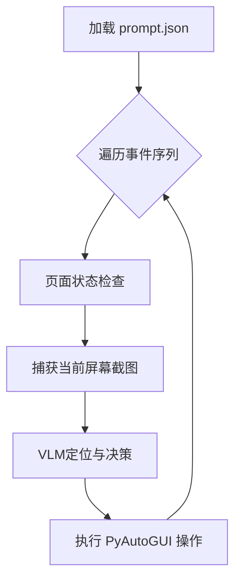

# GUI 自动化 Record 与 Replay 模块文档


### 架构设计


### 安装依赖
```bash
pip install -r requirements_guiagent.txt
```
### 录制流程

```
用户操作
   │
   ├─ 鼠标点击
   │   ├─ Hook 捕获（点击前）
   │   ├─ 截取屏幕（含光标）
   │   ├─ 放入异步队列
   │   └─ 返回，允许点击继续
   │
   ├─ 键盘输入
   │   ├─ 捕获 key_down 事件
   │   ├─ 聚合字符输入
   │   ├─ 检测特殊键
   │   └─ 1秒超时后保存
   │
异步处理队列
   │
   ├─ 调用 OmniParser API
   ├─ 解析 UI 元素
   ├─ 匹配点击的 box
   ├─ 裁剪并保存 clicked_box
   └─ 更新事件数据
   │
保存到 JSON 文件
```
#### 使用指南

```python
# 启动录制
python recorder_agent.py
# 指定保存目录和会话名称
python recorder_agent.py --output_dir ./my_recordings --session_name demo_case
```

结束录制：回到命令行界面，按 Ctrl+Alt+R，等待处理完毕。
#### 录制输出结构

```
recordings/
└── demo_session/
    ├── screenshots/
    │   ├── screenshot_001.png
    │   ├── screenshot_002.png
    │   └── ...
    ├── clicked_boxes/
    │   ├── clicked_box_001.png
    │   ├── clicked_box_002.png
    │   └── ...
    ├── annotated_screenshots/
    │   ├── annotated_001.png  (OmniParser标注)
    │   └── ...
    └── mouse_recording_20241229_120000.json
```

### 生成操作提示
在computer_use.ipynb中执行，生成操作提示prompt

### Replay 模块

#### 重放流程




### 使用指南

#### 启动重放

在终端执行以下命令：

```bash
# 从头开始完整回放
python replay_engine.py --recording recordings/demo_session/prompt.json

# 从指定步骤（第 5 步）开始回放
python replay_engine.py --recording recordings/demo_session/prompt.json --start 5

# 调试模式：单步确认执行
python replay_engine.py --recording recordings/demo_session/prompt.json --step
```

#### 重放输出结构

执行过程中会生成调试信息：

```
replay_temp/                # 临时截图目录
├── screenshot_20241229_120001.png  # 重放时的实时截图
└── vis_001.png             # 可视化标注（红点表示 VLM 点击位置）
replay_logs/                # 执行报告
└── replay_20241229_120500.json     # 记录每一步的成功率、坐标及耗时
```


### 配置说明

#### 环境变量

创建 `.env` 文件：

```env
# VLM API 配置
MODEL_NAME=qwen3-vl-235b-a22b-instruct
API_URL=https://qianfan.baidubce.com/v2
API_KEY="123456"

# OmniParser 配置
OMNIPARSER_URL=http://10.27.233.132:8101/
PADDLEX_URL=http://10.27.233.132:8000/ocr

# 录制配置
RECORDING_DIR=recordings_blip_test2
```

